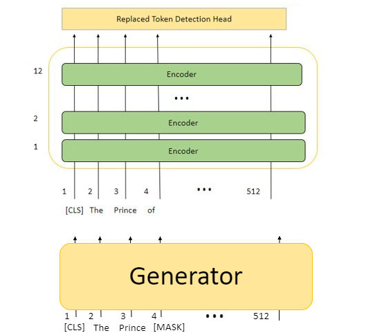
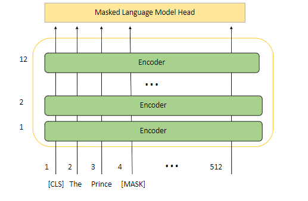

# Code-Switch Arabic-English Contextual Embeddings
  Globalization has caused the rise of the code-switching phenomenon among multilingual societies. In Arab countries, code-switching between Arabic and English has become frequent, especially through social media platforms. Consequently, research in Natural Language Processing (NLP) systems increased to tackle such a phenomenon. One of the significant challenges of developing code-switched NLP systems is the lack of data itself. In this paper, we train bilingual contextual word embedding models using FLAIR, BERT, and ELECTRA.
  We also propose a novel contextual word embedding model called KERMIT, which can efficiently map Arabic and English words inside one vector space in terms of data usage. We applied intrinsic and extrinsic evaluation methods to compare the performance of the models. Our results show that FLAIR and FastText achieve the highest results in the sentiment analysis task. However, KERMIT is the best-achieving model on the intrinsic evaluation and named entity recognition. Also, it outperforms the other transformer-based models on question answering task.

You can download models individually from the table below:

|Pytorch|Tensorflow|
|:---:|:---:|
|[**Flair**][flair]|-|
|[**BERT**][BERT]|[**BERT**][BERT_tf]|
|[**BERT++**][BERT++]|[**BERT++**][BERT_tf_++]|
|[**ELECTRA**][ELECTRA]|[**ELECTRA**][ELECTRA_tf]|
|[**ELECTRA++**][ELECTRA++]|[**ELECTRA++**][ELECTRA_tf_++]|
|[**KERMIT**][KERMIT]|[**KERTMIT**][KERMIT_tf]|
|[**KERMIT++**][KERMIT++]|[**KERTMIT++**][KERMIT_tf_++]|

 
[flair]: https://drive.google.com/drive/folders/1-ORpdwtqGvCWq2SgO9NSbr3_RBHk1VBZ?usp=sharing 
[BERT]: https://drive.google.com/drive/folders/114LStAAM2qWvq01CYSU4b5hD8Q_U306S?usp=sharing
[BERT_tf]: https://drive.google.com/drive/folders/10ZMFOxNfOenYU2fUX5ZNy1CGKRRD6U85?usp=sharing
[BERT++]: https://drive.google.com/drive/folders/1LtkagKM18FLLVF8TkNwTABOKv8s3uJtV?usp=sharing
[BERT_tf_++]: https://drive.google.com/drive/folders/1jiEEyW0zoowtbfSPXh10c7Seqk2vpgqI?usp=sharing
[ELECTRA]: https://drive.google.com/drive/folders/1-D6PCryUoQQc_Zf5PlZpZgiuhS4tR-rT?usp=sharing
[ELECTRA_tf]: https://drive.google.com/drive/folders/1-V9Dw5k4tdmVZAEbPVnL8PdYX0OhXOEq?usp=sharing
[ELECTRA++]: https://drive.google.com/drive/folders/1-U8B5oBtZzVmjyuDkss72lkEMJE8hQL2?usp=sharing
[ELECTRA_tf_++]: https://drive.google.com/drive/folders/1--wrqh9xKcnPb-MujeF4-aQI3_PpyP_3?usp=sharing
[KERMIT]: https://drive.google.com/drive/folders/1_gL0C7O8sEimLo82CComOYSlBh1aycIt?usp=sharing
[KERMIT_tf]: https://drive.google.com/drive/folders/1-9VscQEIwZzOmC5C2EggHnjaelkFbqfj?usp=sharing
[KERMIT++]: https://drive.google.com/drive/folders/1-Wdy16mK1sNYeVmM2SUh9aBLkoH9bnzZ?usp=sharing
[KERMIT_tf_++]: https://drive.google.com/drive/folders/1-4KAldz-Mz5fvU8u5TrjvQBG_4UDCURo?usp=sharing

## KERMIT
   

